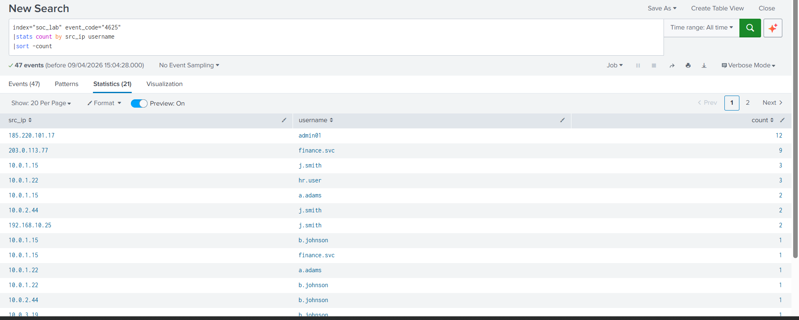
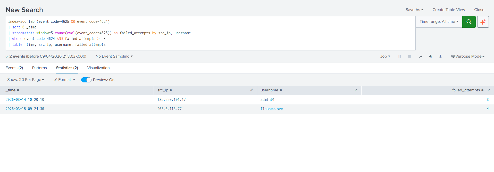
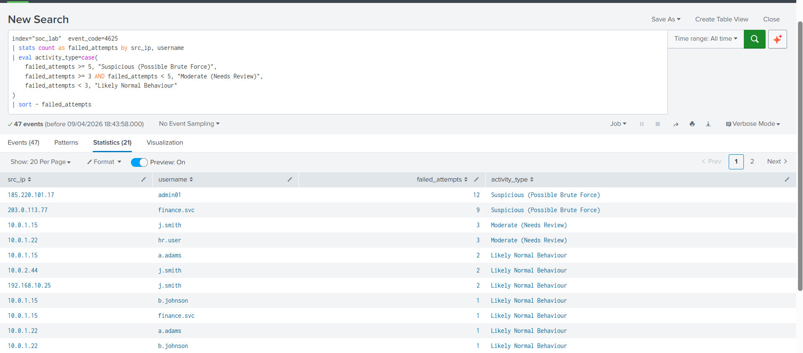
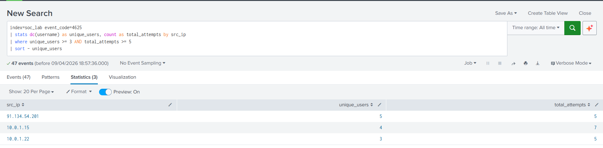

# 🚀 Windows Authentication Threat Hunting (Splunk)

## 🔧 Tools Used
- Splunk (SIEM)
- Windows Event Logs

---

## 📂 Dataset
- Windows authentication logs
- Event ID 4625 (failed login)
- Event ID 4624 (successful login)

---

## 🔍 Detections
- Failed login spikes by IP
- Successful login after multiple failures
- Brute force activity
- Password spray attacks

---

## 📊 Screenshots

### Failed Logins by IP

### Success After Failures

### Brute Force Detection

### Password Spray Detection

---

## ⚖️ Outcome
- Identified brute force attack patterns
- Detected password spray activity
- Distinguished malicious vs normal behaviour
- Mapped activity to MITRE ATT&CK (T1110)

---

## 🎯 Skills Demonstrated
- Log analysis
- Splunk SPL queries
- Threat detection
- Incident investigation
- Security reporting
